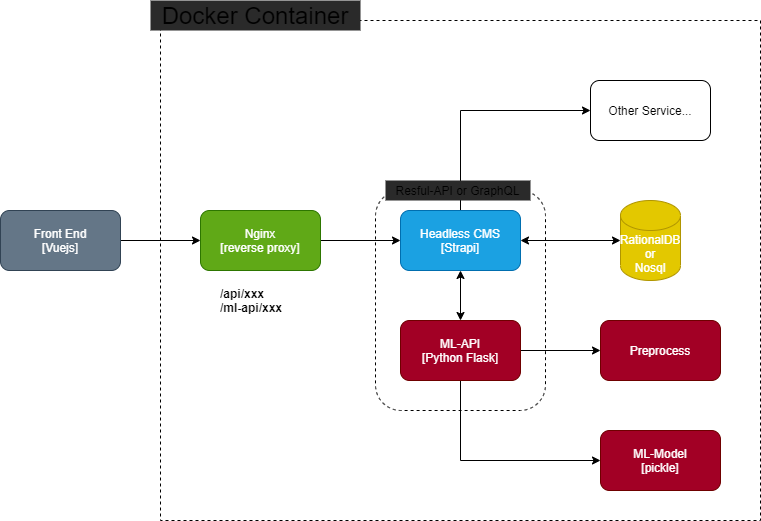

# Stack
    easy CRUD operation it's connected data sci,ml developer to front-end developer to make real product
1. CMS
    - **Strapi is headless cms tools.** [site](https://strapi.io/)  
        Building self-hosted, customizable, and performant content API has never been easier.
    - **Database support** : MongoDB, Mysql , PosgreSQL
2. Ml-Api
    - write with flask api for developer who familiar with python programming
    - if you want to save data to db just call http ajax to CMS

